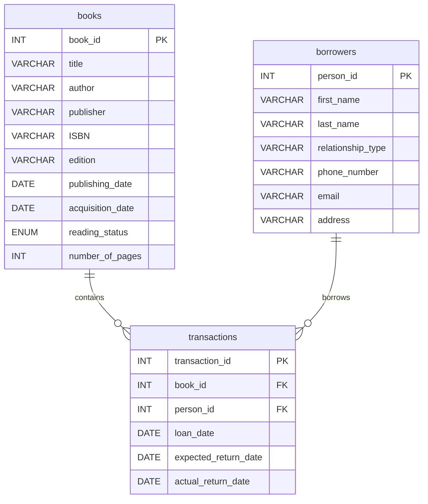

# 📚 Liane’s Library  
*A personal book-loan tracking system, evolving into a smart, AI-powered library.*

---

## 💼 Case Study: Why This Project Exists

Liane is an avid reader, with a growing collection of books she loves to share.  
Unfortunately, when she lends books to friends, colleagues, and even distant acquaintances, many of them forget to return them.

After losing several favorites, Liane shared her frustration over coffee:  

> *“I love sharing my books, but I can’t keep track of who has them.”*

So, if people treat her like a library…  
**Why not become one?**

This project aims to build a simple, user-friendly system so Liane can track:
- Who borrowed each book
- When they should return it
- Which books are overdue

Our mission: **Make book sharing joyful again.**

---

## 🏗️ Architecture & Folder Structure

As the project scales to include AI features and cloud deployment, we adopted a clean, domain-oriented architecture:

```text
lianes-library/
├── data/                  # Raw data, mockups, or backups
├── notebooks/             # Prototyping Jupyter notebooks
├── src/
│   ├── frontend/          # 🎨 Streamlit UI app and components
│   ├── api/               # 🔌 FastAPI routes and endpoints
│   ├── db/                # 🗄️ Relational Database (MySQL) connection and CRUD logic
│   ├── ai/                # 🧠 RAG, NLP, LLMs, Vector Stores (ChromaDB), and Agents
│   ├── schemas/           # 📦 Pydantic Models for data validation
│   ├── core/              # ⚙️ Global configurations and environment variables
│   └── scripts/           # 🛠️ One-off utility or migration scripts
├── .env                   # Environment credentials
├── requirements.txt       # Project dependencies
└── README.md              # Project documentation
```

---

## 🚀 Future Implementation Roadmap (AI & Cloud Era)

This section outlines our strategic pivot towards an AI-powered, cloud-native architecture. While maintaining our core mission of tracking book loans, Liane's Library is evolving into a smart system leveraging Retrieval-Augmented Generation (RAG) and Natural Language Processing (NLP).

### ☁️ Cloud & Infrastructure Migration
1. **Fully Managed Cloud Deployment**
    - Migrate the local MySQL database to a managed cloud provider (e.g., Supabase, AWS RDS, or PlanetScale) to ensure high availability.
    - Deploy the Streamlit frontend to Streamlit Community Cloud or Vercel.
    - Containerize the backend API (FastAPI) using Docker and deploy via Google Cloud Run or AWS AppRunner.

2. **Vector Database Integration**
    - Transition local vector stores (`ChromaDB`) to a robust cloud environment (e.g., Pinecone, Weaviate, or Chroma Cloud) to persist embeddings for book summaries and metadata.

### 🧠 AI & NLP Integration (The "Smart Library")
3. **Semantic Search & RAG Assistant**
    - **Vibe Search:** Allow users to search for books using natural language (e.g., *"A sci-fi book about space travel and philosophy"*) instead of relying solely on exact title/author matches.
    - **Library Chatbot:** Implement a conversational agent (using LangChain and LLMs) that can answer queries like: *"Who currently has my copy of The Great Gatsby?"* or *"Which of my friends are overdue on their returns?"*

4. **Automated Metadata & Enrichment**
    - Build an NLP pipeline to automatically extract and normalize author names, genres, and themes from raw text or external APIs (Google Books/OpenLibrary).
    - Implement Fuzzy Matching to prevent duplicate borrower profiles (e.g., resolving "Jeorge Silva" vs. "Jeorge Cassio").

5. **Smart Alerts & Insights**
    - Use NLP to analyze reading habits and generate personalized borrowing recommendations for Liane's friends.
    - Implement an intelligent, automated email/WhatsApp notification system for overdue books, using generated polite reminders.

### 📚 Core System Enhancements (Legacy Support)
6. **Damage & Loss Registry**
    - Maintain a dedicated flow for registering damaged or lost books, automatically synchronizing book availability status.
    
7. **Audit & Analytics Dashboard**
    - Track system usage, loan frequency, and RAG query patterns to understand how the library is being searched and utilized.

---

## 🧱 Tech Stack

| Layer | Tool |
|-------|------|
| 🗄️ **Relational Database** | MySQL (Migrating to Cloud) |
| 🗂️ **Vector Database** | ChromaDB / Pinecone |
| 🐍 **Backend & API** | Python, FastAPI, Pydantic, SQLAlchemy |
| 🧠 **AI & NLP** | LangChain, HuggingFace, OpenAI (or open-source LLMs) |
| 🎨 **Frontend** | Streamlit |
| ☁️ **Deployment** | Docker, Streamlit Cloud, AWS / GCP |
| 🔗 **Version Control** | Git + GitHub |

---

### 🗄️ Database Design (ER Diagram)


```
