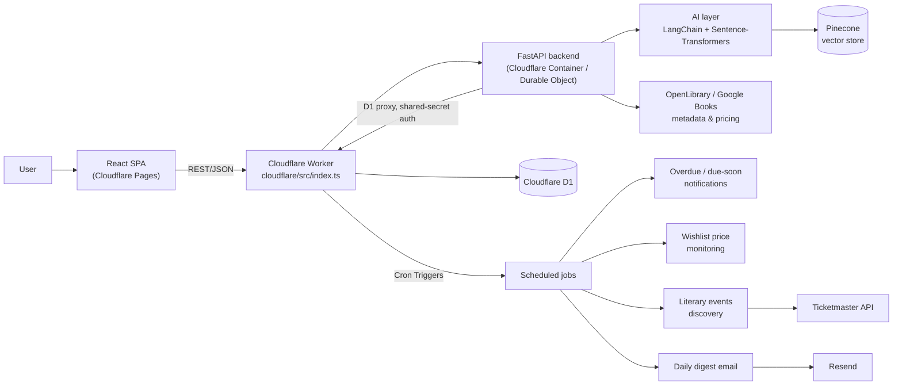
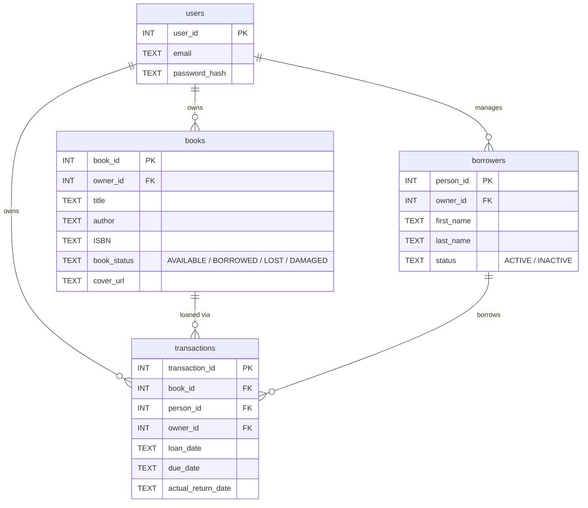

# 📚 Liane's Library — Personal Library, Lending & Reading Companion


**🔗 Live app: [lianes-library.pages.dev](https://lianes-library.pages.dev/)**

---

## Problem

People who lend books to friends or family lose track of who has what, when it's due, and what's overdue. On top of that, personal readers juggle a wishlist scattered across notes, no visibility into price drops on books they want, no memory of what they meant to read next, and no easy way to discover literary events nearby. Library-management software exists, but it's built for institutions, not a personal lending circle and reading habit.

## Solution

A personal library hub covering the full loop: track what you own and who borrowed it, track what *you've* borrowed from others, keep a reading queue and journal, get AI-personalized recommendations, monitor wishlist prices, and discover literary events — wrapped in a React SPA with a light/dark, bento-style dashboard.

The backend runs as a FastAPI app inside a Cloudflare Container (Durable Object), backed by Cloudflare D1 (SQLite at the edge) and a Pinecone vector store for semantic ("vibe") search and recommendations. A Cloudflare Worker handles routing, a D1 proxy for the container, and four staggered cron jobs (overdue/due-soon notifications, wishlist price checks, literary-events discovery, and a daily digest email via Resend).

## Architecture



### Database design (core schema, Cloudflare D1)



Beyond this core (loans-to-others) schema, the D1 database also holds tables for: reading queue & journal (`reading_log`, `journal_entries`), books borrowed *from* others (`borrow_records`), in-app alerts (`notifications`), wishlist tracking (`wishlist_items`, `wishlist_price_snapshots`), the recommendations cache (`recommendation_cache`, `recommendation_dismissals`), and literary events (`literary_events`, `user_event_preferences`) — see `cloudflare/migrations/`.

## Screenshots

<!-- TODO: drop current screenshots into docs/screenshots/ and swap the placeholders below. -->

| Dashboard | Book Catalog | Reading / Wishlist |
|---|---|---|
| *(screenshot coming soon)* | *(screenshot coming soon)* | *(screenshot coming soon)* |

## Key features

- **Loan management**: register loans to borrowers, due dates, automatic overdue detection and in-app/email notifications.
- **Peguei Emprestado**: track books *you* borrowed from others, with due-soon reminders.
- **Minha Leitura**: a reading queue plus a per-book reading journal.
- **Wishlist & price monitoring**: track wanted books, automatic price checks (Google Books), price-drop alerts.
- **Recommendations engine**: personalized picks reusing the same embeddings/Pinecone infrastructure as vibe search, cached with a 7-day TTL and one-click dismiss.
- **Literary events**: nearby events discovered via Ticketmaster, plus manually-added fallback events.
- **Vibe search**: semantic search by mood or plot description, not exact keywords, via `/search/vibe`.
- **Multi-user auth**: JWT-based auth with per-user data ownership across every feature.
- **Analytics dashboard**: loan frequency, reading stats and overdue trends.
- **Barcode scanning**: add books by scanning an ISBN barcode (ZXing) with OpenLibrary metadata lookup.
- **Bento-style dashboard**: light/dark theme toggle, "at a glance" stats, continue-reading hero, and shelf carousels.

## Tech Stack

| Layer | Tool |
|---|---|
| Frontend | React 19 · TypeScript · Vite · Tailwind CSS v4 · TanStack Query · React Router |
| Barcode scanning | ZXing (`@zxing/browser`, `@zxing/library`) |
| Backend API | Python · FastAPI · Pydantic · JWT auth (PyJWT + bcrypt) |
| Database | Cloudflare D1 (SQLite at the edge) |
| Compute | Cloudflare Workers · Durable Objects · Containers |
| Vector store | Pinecone |
| AI / NLP | LangChain · HuggingFace · Sentence-Transformers (semantic search + recommendations) |
| Scheduled jobs | Cloudflare Cron Triggers |
| Email | Resend |
| External APIs | OpenLibrary · Google Books · Ticketmaster |
| Hosting | Cloudflare Pages (frontend) · Cloudflare Workers (API + jobs) |
| Containerization / CI | Docker · GitHub Actions → Docker Hub / GHCR |

## Quickstart (local)

```bash
git clone https://github.com/jeorgesilva/lianes-library.git
cd lianes-library
```

**Frontend** (`web/`):
```bash
cd web
npm install
echo "VITE_API_URL=http://localhost:8080" > .env
npm run dev
```

**Cloudflare Worker** (routing, D1 proxy, cron jobs — `cloudflare/`):
```bash
cd cloudflare
npm install
npx wrangler d1 migrations apply lianes-library --local
npm run dev   # wrangler dev
```

**API backend** (FastAPI, container image built from the repo root):
```bash
pip install -r requirements-api.txt
# Requires: D1_PROXY_URL, INTERNAL_D1_TOKEN (must match the Worker),
# JWT_SECRET, PINECONE_API_KEY, PINECONE_INDEX_NAME, HF_API_TOKEN
uvicorn src.api.main:app --reload --port 8080
```

Optional secrets for the scheduled jobs (`cloudflare/`, set via `wrangler secret put`): `RESEND_API_KEY`, `RESEND_FROM_EMAIL`, `GOOGLE_BOOKS_API_KEY`, `TICKETMASTER_API_KEY` — every job degrades gracefully (mock-logs or skips) when its optional secret is unset.

## Project structure

```
lianes-library/
├── web/                      # React SPA (Vite + Tailwind), deployed to Cloudflare Pages
│   └── src/
│       ├── pages/            # Dashboard, Catalog, Loans, Reading, Wishlist, Events, Analytics, ...
│       ├── components/       # Shared UI (BookCard, Sidebar, ThemeToggle, BarcodeScanner, ...)
│       └── lib/               # API client
├── src/                      # FastAPI backend (runs inside a Cloudflare Container)
│   ├── api/routers/           # REST endpoints (books, loans, wishlist, recommendations, events, ...)
│   ├── db/                     # D1 client + CRUD
│   ├── ai/                      # Embeddings, Pinecone vector store, recommendations
│   └── schemas/                  # Pydantic models
├── cloudflare/                # Worker: routing, D1 proxy, cron jobs, migrations
│   ├── src/                    # notifications, wishlist, events, digest, index.ts
│   └── migrations/              # D1 schema (source of truth)
├── docs/                      # Design/planning docs
├── data/ · notebooks/ · reports/   # Prototyping artifacts and exports
├── Dockerfile                 # API container image (built via GitHub Actions)
└── requirements-api.txt       # Runtime deps for the containerized API
```

## Roadmap

- **Automated tests**: no test suite yet (`oxlint` covers linting only) — add unit/integration coverage for the API and Worker cron jobs.
- **Smart notifications**: expand beyond overdue/due-soon/price-drop to configurable reminder templates.
- **Conversational assistant**: natural-language querying on top of the existing semantic search (`SmartAssistant` page).
- **Demo video**: record a walkthrough of the current app.

## Notes & best practices

- **Privacy**: store borrower/personal contact data responsibly; do not commit secrets (`.env`, API keys).
- **Multi-user isolation**: every table and query is scoped by `owner_id` — verify this holds for any new feature.
- **Graceful degradation**: optional integrations (Resend, Google Books, Ticketmaster) are designed to degrade rather than fail when unconfigured — follow this pattern for new external integrations.

## Contact

**Jeorge Silva** — Project maintainer
GitHub: `github.com/jeorgesilva` · Email: `jeorgecassil@gmail.com`

## License

MIT License — free for personal and commercial use.
