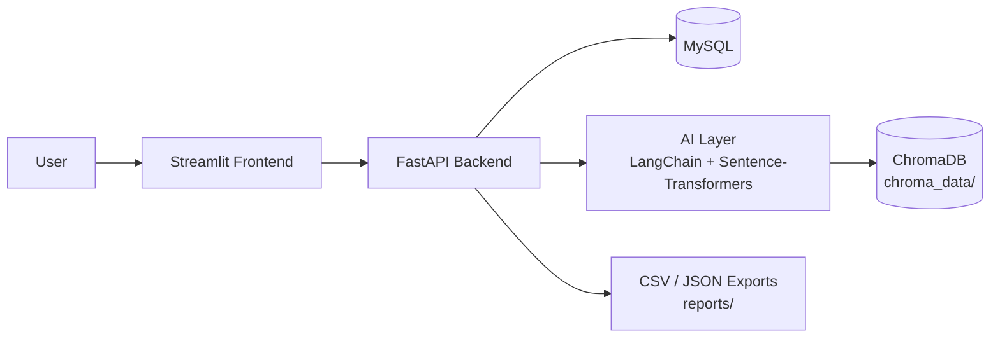
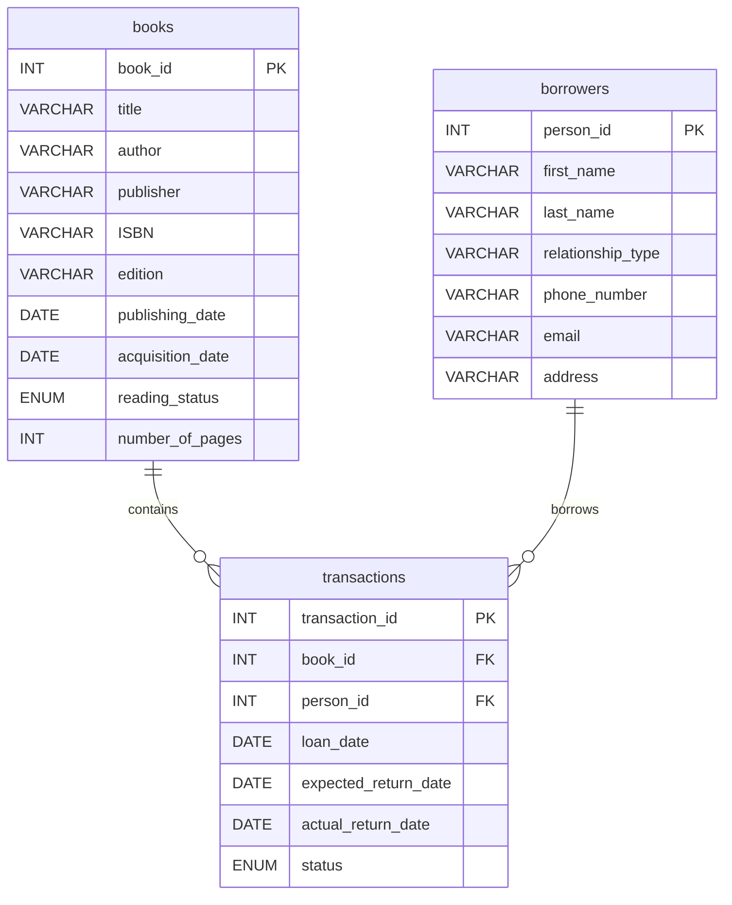
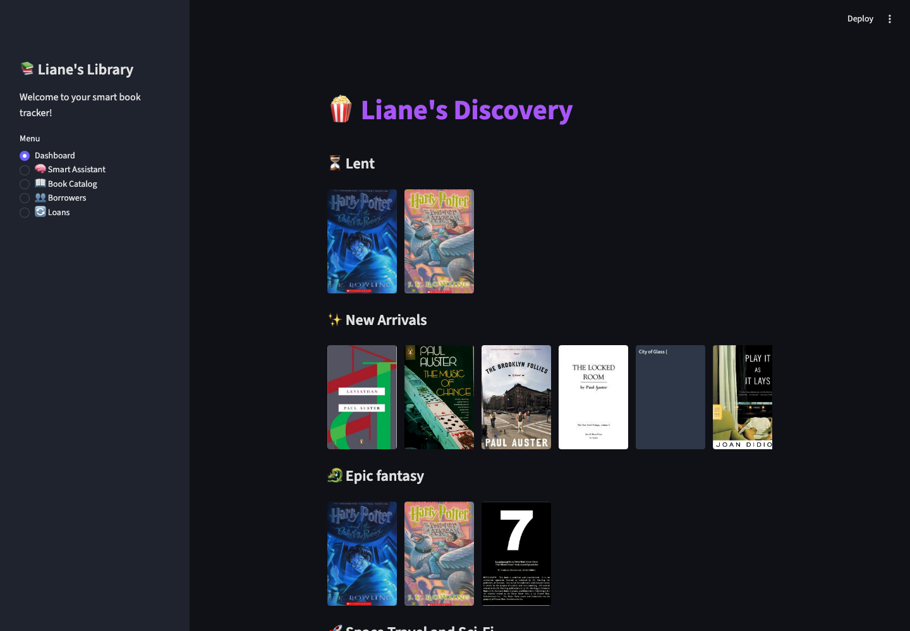
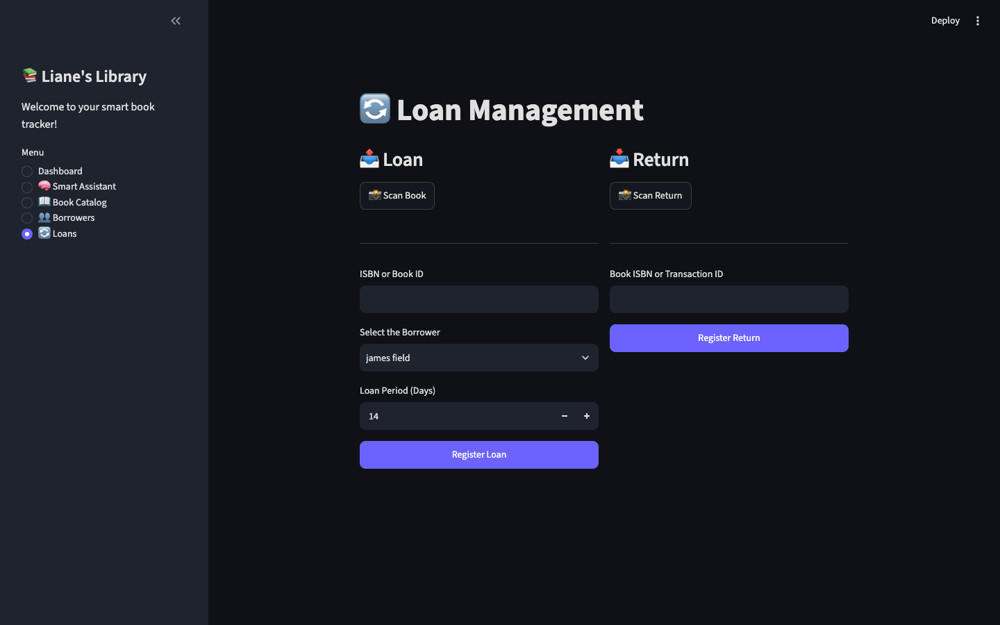
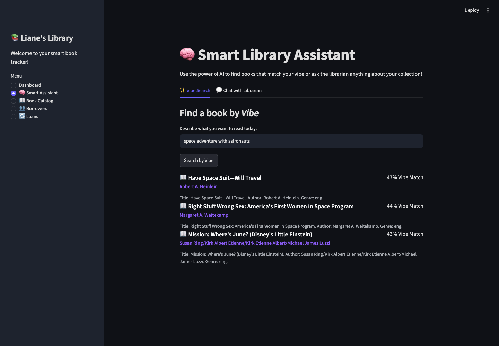

# 📚 Liane's Library — Personal Book-Loan Tracker & Smart Library Prototype


---

## Problem

People who lend books to friends or family lose track of who has what, when it's due, and what's overdue — usually via memory or scattered notes. Library-management software exists, but it's built for institutions, not a personal lending circle.

## Solution

A lightweight loan-tracking system (FastAPI + MySQL + Streamlit) that logs every loan and its expected return date, flags overdue books automatically, and layers AI features — semantic book search and fuzzy duplicate-borrower matching via ChromaDB — on top of the core tracking workflow, so it can grow from a simple tracker into a smart personal-library assistant.

## Architecture



### Database design (ER diagram)



## Screenshots

| Loan dashboard | Loan management | Semantic search |
|---|---|---|
|  |  |  |

## Tech Stack

| Layer | Tool |
|---|---|
| Database | MySQL (local → cloud) |
| Vector store | ChromaDB / Pinecone |
| Backend | Python · FastAPI · SQLAlchemy · Pydantic |
| Frontend | Streamlit |
| AI / NLP | LangChain · HuggingFace · Sentence-Transformers |
| Deployment | Docker · Streamlit Cloud (`packages.txt` + `.streamlit/` already in repo) |
| Versioning | Git · GitHub |

## Demo Video

> *Placeholder — record a 60–90s walkthrough: add a loan → show the overdue list → run a semantic search.*

`[demo video link]`

---

## Key features

- **Loan management**: register loans, expected return dates and actual returns.
- **Borrower profiles**: contact info, relationship type and history.
- **Overdue detection**: automatic flags for late returns and simple notification hooks.
- **Search & metadata**: title/author search with optional enrichment from external APIs (OpenLibrary / Google Books).
- **AI enhancements**: semantic search and fuzzy duplicate-borrower matching (ChromaDB — `chroma_data/` confirms this has actually been run, not just planned).
- **Export & reports**: CSV/JSON exports and printable loan summaries (`reports/`).

## Quickstart (local)

```bash
git clone https://github.com/jeorgesilva/lianes-library.git
cd lianes-library
python -m venv .venv
source .venv/bin/activate   # Windows: .venv\Scripts\activate
pip install -r requirements.txt

# Configure .env with DB credentials and optional API keys (OpenLibrary, Google Books)

# API
uvicorn src.api.main:app --reload

# Frontend (Streamlit)
streamlit run src/frontend/app.py
```

## Project structure

```
lianes-library/
├── src/
│   ├── frontend/          # Streamlit UI
│   ├── api/                # FastAPI routes
│   ├── db/                  # Models, migrations, CRUD
│   ├── ai/                   # RAG, NLP, vector store integration
│   ├── schemas/                # Pydantic models
│   └── core/                    # Config and environment handling
├── chroma_data/                   # Persisted ChromaDB embeddings
├── data/                            # Raw data, mockups, backups
├── notebooks/                         # Prototypes and data exploration
├── reports/                             # CSV/JSON exports, loan summaries
├── .streamlit/                            # Streamlit Cloud config/secrets
├── packages.txt                             # System deps (Streamlit Cloud)
└── requirements.txt
```

## Roadmap

- **Cloud migration**: move MySQL to a managed DB (Supabase / RDS / PlanetScale).
- **Vector store**: persist embeddings in Pinecone / Weaviate or Chroma Cloud.
- **Conversational assistant**: natural-language querying on top of the existing semantic search.
- **Automated enrichment**: fetch metadata from OpenLibrary / Google Books and normalize authors/genres.
- **Smart notifications**: automated, polite reminders via email/WhatsApp (configurable templates).
- **Analytics**: dashboard for loan frequency, most-borrowed books and overdue trends.

## Notes & best practices

- **Privacy**: store personal contact data responsibly; do not commit secrets.
- **Reproducibility**: sample data and migration scripts included for easy setup.
- **Data enrichment**: external APIs used sparingly, with caching to avoid rate limits.

## Contact

**Jeorge Silva** — Project maintainer
GitHub: `github.com/jeorgesilva` · Email: `jeorgecassil@gmail.com`

## License

MIT License — free for personal and commercial use.
