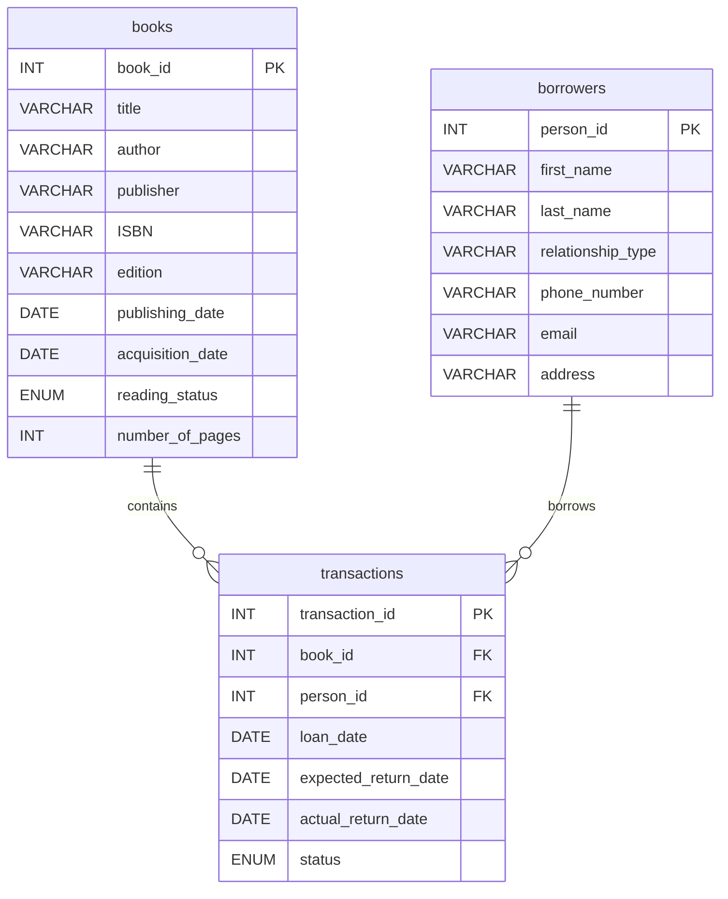

# 📚 Liane’s Library — Personal Book‑Loan Tracker & Smart Library Prototype

     

---

## Short description

Liane’s Library is a lightweight book‑loan tracking system that evolves into a smart, AI‑powered personal library.  
Core flow: **Loan tracking (DB)** → **User interface (Streamlit)** → **Optional AI features (RAG, semantic search)**.  
Target: individuals who lend books and want a simple, reliable way to track borrowers, due dates and overdue items.

---

## Key features

- **Loan management**: register loans, expected return dates and actual returns.  
- **Borrower profiles**: contact info, relationship type and history.  
- **Overdue detection**: automatic flags for late returns and simple notification hooks.  
- **Search & metadata**: title/author search with optional enrichment from external APIs (OpenLibrary / Google Books).  
- **AI enhancements (optional)**: semantic search, fuzzy matching for duplicate borrowers, and a conversational assistant for queries.  
- **Export & reports**: CSV/JSON exports and printable loan summaries.

---

## Outputs

- `data/` → raw exports, backups and knowledge base files  
- `db/` → migration scripts and sample SQL dumps  
- `docs/` → UI screenshots, ER diagram and usage notes  
- `exports/` → CSV/JSON reports and overdue lists

---

## Project structure (recommended)

```
lianes-library/
├── data/                  # Raw data, mockups, backups
├── docs/                  # Screenshots, ER diagrams, experiment notes
├── notebooks/             # Prototypes and data exploration
├── src/
│   ├── frontend/          # Streamlit UI app and components
│   ├── api/               # FastAPI routes and endpoints
│   ├── db/                # DB models, migrations, CRUD logic
│   ├── ai/                # RAG, NLP, vector store integration
│   ├── schemas/           # Pydantic models
│   ├── core/              # Config and environment handling
│   └── scripts/           # Utilities and migration scripts
├── .env                   # Environment credentials (not committed)
├── requirements.txt
└── README.md
```

---

## Quickstart (local)

1. **Clone**
```bash
git clone https://github.com/<your-org>/lianes-library.git
cd lianes-library
```

2. **Environment**
```bash
python -m venv .venv
source .venv/bin/activate   # macOS / Linux
.venv\Scripts\activate      # Windows
pip install -r requirements.txt
```

3. **Configure**
- Create `.env` with DB credentials and optional API keys (OpenLibrary, Google Books).

4. **Database**
```bash
# Example: run migrations or load sample data
python src/db/init_db.py
```

5. **Run services**
```bash
# API
uvicorn src.api.main:app --reload

# Frontend (Streamlit)
streamlit run src.frontend.app.py
```

---

## Roadmap (AI & Cloud)

- **Cloud migration**: move MySQL to managed DB (Supabase / RDS / PlanetScale).  
- **Vector store**: persist embeddings in Pinecone / Weaviate or Chroma Cloud.  
- **Semantic search & RAG**: natural language search and a conversational assistant for library queries.  
- **Automated enrichment**: fetch metadata from OpenLibrary / Google Books and normalize authors/genres.  
- **Smart notifications**: automated, polite reminders via email/WhatsApp (configurable templates).  
- **Analytics**: dashboard for loan frequency, most‑borrowed books and overdue trends.

---

## Tech stack

| Layer | Tool |
|---|---|
| Database | MySQL (local → cloud) |
| Vector store | ChromaDB / Pinecone |
| Backend | Python · FastAPI · SQLAlchemy · Pydantic |
| Frontend | Streamlit |
| AI / NLP | LangChain · HuggingFace · Sentence‑Transformers |
| Deployment | Docker · Cloud Run / Streamlit Cloud |
| Versioning | Git · GitHub |

---

## Database design (ER diagram)



---

## Notes & best practices

- **Privacy**: store personal contact data responsibly; do not commit secrets.  
- **Reproducibility**: include sample data and migration scripts for easy setup.  
- **Data enrichment**: use external APIs sparingly and cache results to avoid rate limits.  
- **Testing**: add unit tests for DB logic and API endpoints; include integration tests for key flows.

---

## How to contribute

- Open an issue for bugs or feature requests.  
- Create a branch `feature/<name>` and submit a PR to `main`.  
- Include tests for new features and update docs when behavior changes.

---

## Contact

**Jeorge Silva** — Project maintainer  
GitHub: `github.com/jeorgesilva` · Email: `jeorgecassil@gmail.com`

---

## License

MIT License — free for personal and commercial use.
```
